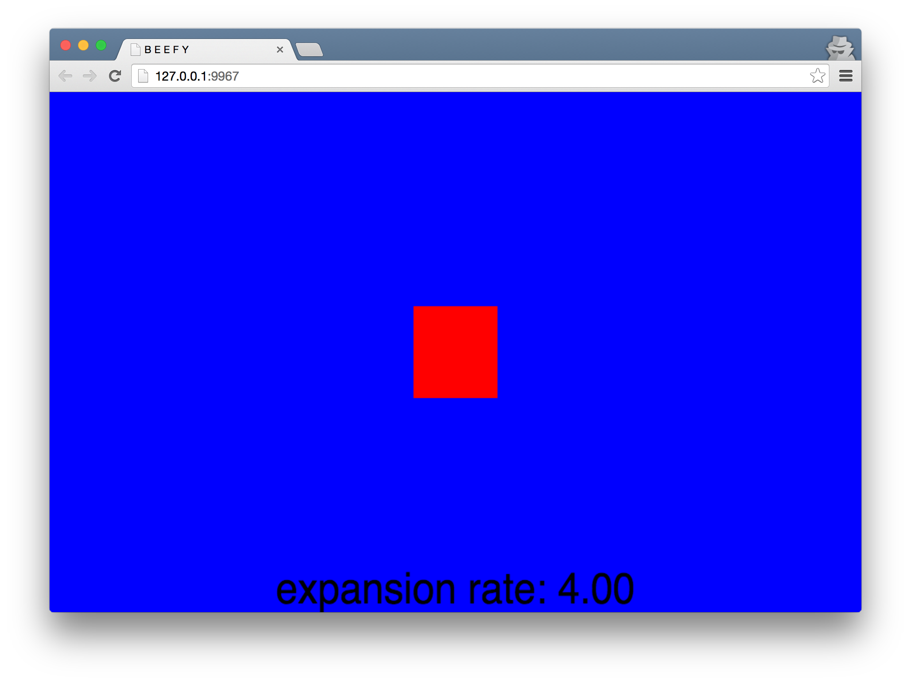

# Expanding Square
*An html5 canvas example of an expanding square*



## Live Demo
[Square Play](http://seanewest.github.io/squareplay)

## Install Locally
```
git clone https://github.com/seanewest/squareplay.git
cd squareplay
```

## Run
```
npm start
```

## Build (gh-pages)
```
npm run build
```
